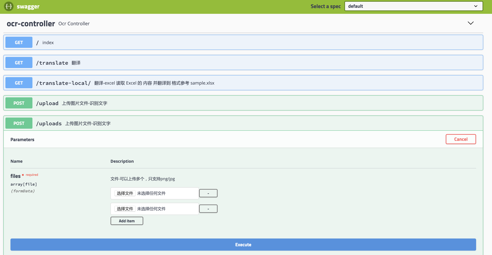
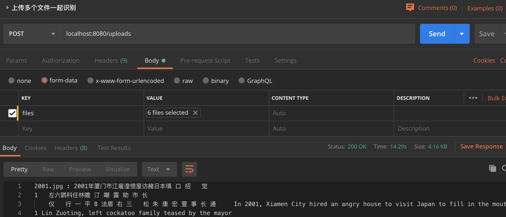

### ocr-service is just a toy

there is the features

1. [x] ocr the pnc/jpg file with chinese/english/dight/japanese
2. [x] translate content with Google Translate Api
3. [x] multi file ocr
4. [x] translate excel file with fixed format!
--

Excel 格式如下 (格式参考 sample.xlsx)

|name or no| origin-content | translated-content|
|---| -- | -- 
|1 | hello|こんにちは|

具体接口参考 [swagger](http://localhost:8080/swagger-ui.html)

### images

### depend on

you need to install your tesseract-ocr first

the set the local path of `TESS_DATA` in the Constant.java

- [easyexcel](https://alibaba-easyexcel.github.io/)
- [tess4j](http://tess4j.sourceforge.net/)
- [tesseract-ocr](https://tesseract-ocr.github.io/)